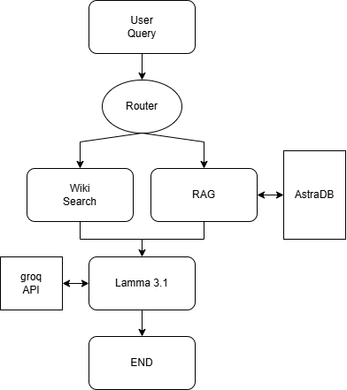

# Enhanced-SMART-FINBOT
This is an enhanced version of [previous_project](https://github.com/dev484p/Smart-FinAI)

Enhanced-SMART-FINBOT is an advanced finance chatbot that leverages LangGraph architecture with multi-agent AI tools to provide precise and relevant information on financial topics. The project integrates Retrieval-Augmented Generation (RAG), LangGraph, and cutting-edge machine learning and database tools to create a powerful conversational assistant for finance professionals and enthusiasts.

## Featuers 
* Multi-Agent Architecture: Utilizes LangGraph for routing queries to the appropriate processing agents.
* RAG Integration: Implements Retrieval-Augmented Generation for context-based responses on financial topics.
* Groq API with Llama 3.1: Leverages the Llama 3.1 LLM for accurate and insightful query handling.
* AstraDB as Vector Database: Enables efficient and scalable vector storage for RAG retrieval.
* WikipediaAPIWrapper: Routes non-financial queries to Wikipedia for accurate context.
* HuggingFaceEmbeddings: Provides robust embeddings for semantic search and query understanding.
* Python-Based Workflow: Developed using Python for seamless integration and extensibility.

## Workflow

### 1.User Query: 
  The user submits a query.
### 2.Query Routing:
  * If the query pertains to Finance, Economics, Money/Risk Management, Accounting, or Investing, it is routed to the RAG pipeline.
  * Otherwise, it is routed to the WikipediaAPIWrapper.
### 3.Context Generation:
  * For financial queries, the RAG pipeline retrieves context from AstraDB.
  * For non-financial queries, WikipediaAPIWrapper provides relevant information.
### 4.LLM Processing: 
  The query, along with the generated context, is passed to the Llama 3.1 model via the Groq API.
### 5.Response Generation: 
  The chatbot generates and delivers an insightful and precise response to the user.

## Tools and Technologies
* LangGraph: Facilitates multi-agent architecture for query routing and processing.
* Groq API: Interfaces with the Llama 3.1 LLM for advanced natural language processing.
* AstraDB: Provides scalable vector storage for efficient retrieval in RAG.
* WikipediaAPIWrapper: Handles general knowledge queries outside the financial domain.
* HuggingFaceEmbeddings: Enhances semantic understanding of queries.
* Python: Powers the backend logic and integrations.

## Getting Started

### Prerequisites
* AstraDB account and setup. Refer to the [documentation](https://docs.datastax.com/en/astra-db-serverless/databases/create-database.html)
* Groq API key. Refer to the [documentation](https://docs.aicontentlabs.com/articles/groq-api-key/)

### Installation and Setup
* Run the following commands:
  ```
  git clone https://github.com/dev484p/Enhanced-SMART-FINBOT
  cd Enhanced-SMART-FINBOT
  ```
* Enter your Groq API_key, AstraDB token and database ID in [keys.json](https://github.com/dev484p/Enhanced-SMART-FINBOT/blob/main/VectorDB/keys.JSON).
* Install dependencies:
  ```
  pip install -r requirements.txt
  ```
* Run the jupiter notebook [database_creation](https://github.com/dev484p/Enhanced-SMART-FINBOT/blob/main/VectorDB/database_creation.ipynb) to add the vectors of the pdf in AstraDB.
* Run the following command to initiate the chatbot:
  ```
  python chatbot.py
  ```
* Chat with the bot and press 'q' to exit :)

Contributions are welcome! Please fork the repository and submit a pull request with your changes.

## Refrence
* https://arxiv.org/pdf/2407.19994
